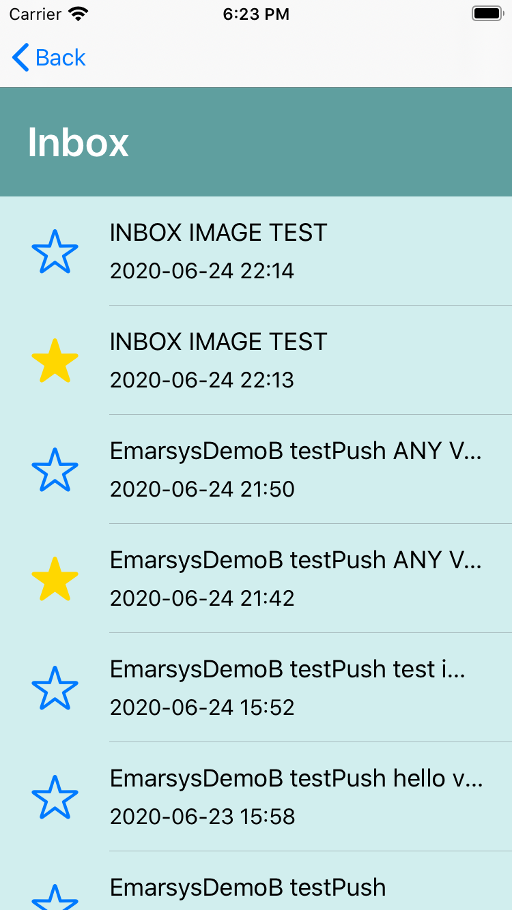

# ios-mobile-inbox

## Setup
1. Cocoapods
```
pod 'EmarsysInbox', :git => 'https://github.com/emartech/ios-mobile-inbox.git'
```
2. Init EmarsysInboxController with new()
```
navigationController?.pushViewController(EmarsysInboxController.new(), animated: true)
```

## Configurable variables
You may customize the view with the static variables in `EmarsysInboxConfig` .
```
EmarsysInboxConfig.bodyForegroundColor = .black
```

var headerBackgroundColor: UIColor?

var headerForegroundColor: UIColor?

var bodyBackgroundColor: UIColor?

var bodyForegroundColor: UIColor?

var bodyTintColor: UIColor?

var bodyHighlightTintColor: UIColor?

var activityIndicatorColor: UIColor?

var favImageOff: UIImage?

var favImageOn: UIImage?

## Screenshots

